20210328\_r\_histogram
================
Jianru<br>
Last compiled on Sun Mar 28 17:26:46 2021, PDT

``` r
library(pacman)
```

    ## Warning: package 'pacman' was built under R version 4.0.4

``` r
p_load(datasets, ggplot2, ggthemes, dplyr, grid, RColorBrewer, tidyverse)
```

``` r
data(airquality)
glimpse(airquality)
```

    ## Rows: 153
    ## Columns: 6
    ## $ Ozone   <int> 41, 36, 12, 18, NA, 28, 23, 19, 8, NA, 7, 16, 11, 14, 18, 14, ~
    ## $ Solar.R <int> 190, 118, 149, 313, NA, NA, 299, 99, 19, 194, NA, 256, 290, 27~
    ## $ Wind    <dbl> 7.4, 8.0, 12.6, 11.5, 14.3, 14.9, 8.6, 13.8, 20.1, 8.6, 6.9, 9~
    ## $ Temp    <int> 67, 72, 74, 62, 56, 66, 65, 59, 61, 69, 74, 69, 66, 68, 58, 64~
    ## $ Month   <int> 5, 5, 5, 5, 5, 5, 5, 5, 5, 5, 5, 5, 5, 5, 5, 5, 5, 5, 5, 5, 5,~
    ## $ Day     <int> 1, 2, 3, 4, 5, 6, 7, 8, 9, 10, 11, 12, 13, 14, 15, 16, 17, 18,~

``` r
summary(airquality)
```

    ##      Ozone           Solar.R           Wind             Temp      
    ##  Min.   :  1.00   Min.   :  7.0   Min.   : 1.700   Min.   :56.00  
    ##  1st Qu.: 18.00   1st Qu.:115.8   1st Qu.: 7.400   1st Qu.:72.00  
    ##  Median : 31.50   Median :205.0   Median : 9.700   Median :79.00  
    ##  Mean   : 42.13   Mean   :185.9   Mean   : 9.958   Mean   :77.88  
    ##  3rd Qu.: 63.25   3rd Qu.:258.8   3rd Qu.:11.500   3rd Qu.:85.00  
    ##  Max.   :168.00   Max.   :334.0   Max.   :20.700   Max.   :97.00  
    ##  NA's   :37       NA's   :7                                       
    ##      Month            Day      
    ##  Min.   :5.000   Min.   : 1.0  
    ##  1st Qu.:6.000   1st Qu.: 8.0  
    ##  Median :7.000   Median :16.0  
    ##  Mean   :6.993   Mean   :15.8  
    ##  3rd Qu.:8.000   3rd Qu.:23.0  
    ##  Max.   :9.000   Max.   :31.0  
    ## 

``` r
sample_frac(airquality, .1)
```

    ##    Ozone Solar.R Wind Temp Month Day
    ## 1     NA     255 12.6   75     8  23
    ## 2      7      48 14.3   80     7  15
    ## 3     NA     101 10.9   84     7   4
    ## 4     96     167  6.9   91     9   1
    ## 5    118     225  2.3   94     8  29
    ## 6     23      14  9.2   71     9  22
    ## 7     24     238 10.3   68     9  19
    ## 8     73     183  2.8   93     9   3
    ## 9     37     279  7.4   76     5  31
    ## 10    NA     291 14.9   91     7  14
    ## 11    NA     127  8.0   78     6  26
    ## 12    NA      31 14.9   77     6  29
    ## 13    59     254  9.2   81     7  31
    ## 14    13     112 11.5   71     9  15
    ## 15    32     236  9.2   81     7   3

``` r
p1 <- airquality %>% 
  ggplot(aes(x = Ozone))+
  geom_histogram()
p1
```

    ## `stat_bin()` using `bins = 30`. Pick better value with `binwidth`.

    ## Warning: Removed 37 rows containing non-finite values (stat_bin).

<!-- -->

``` r
# add normalized density plot
p2 <- airquality %>% 
  ggplot(aes(x=Ozone))+
  # y as density instead of counts
  geom_histogram(aes(y=..density..))+
  stat_function(fun = dnorm, color=2, args = list(mean=mean(airquality$Ozone, na.rm = TRUE),
                                                    sd=sd(airquality$Ozone, na.rm = TRUE)))

p2
```

    ## `stat_bin()` using `bins = 30`. Pick better value with `binwidth`.

    ## Warning: Removed 37 rows containing non-finite values (stat_bin).

<!-- -->

``` r
# by default geom_histogram gives count as y, you can also specify it
p3 <- airquality %>% 
  ggplot(aes(x=Ozone))+
  geom_histogram(aes(y=..count..))+
  theme_economist()
p3
```

    ## `stat_bin()` using `bins = 30`. Pick better value with `binwidth`.

    ## Warning: Removed 37 rows containing non-finite values (stat_bin).

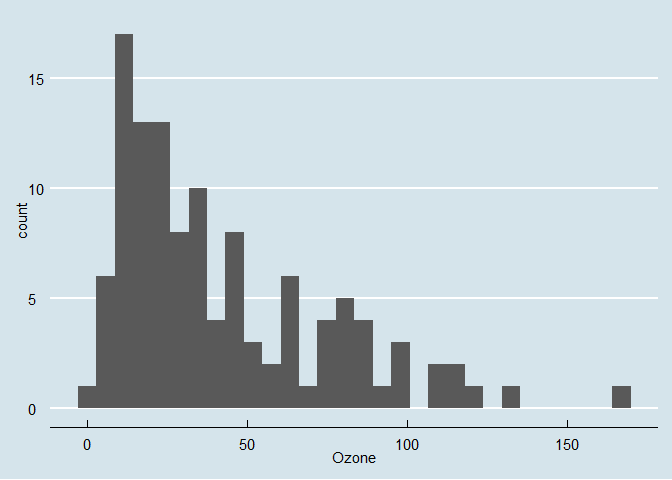<!-- -->

``` r
# change the binwidth, larger binwidth -> coarse hist
p4 <- airquality %>% 
  ggplot(aes(x=Ozone))+
  geom_histogram(aes(y=..count..), binwidth = 4)
  
  
p4
```

    ## Warning: Removed 37 rows containing non-finite values (stat_bin).

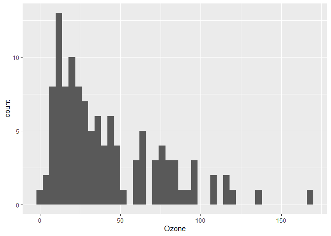<!-- -->

``` r
p5 <- p4+
  scale_x_continuous(name = 'Mean ozone in\n parts per billion')+
  scale_y_continuous(name = "Count")
  
p5
```

    ## Warning: Removed 37 rows containing non-finite values (stat_bin).

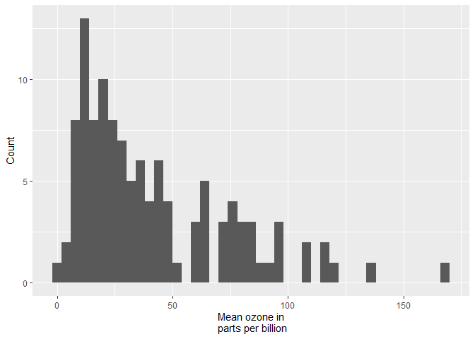<!-- -->

``` r
# set axis ticks
p6 <- p4+
  scale_x_continuous(name = "Mean ozone in\nparts per billion",
                     breaks = seq(0, 175, 15), 
                     limits = c(0, 175))+
  scale_y_continuous(name = "Count")


p6
```

    ## Warning: Removed 37 rows containing non-finite values (stat_bin).

    ## Warning: Removed 2 rows containing missing values (geom_bar).

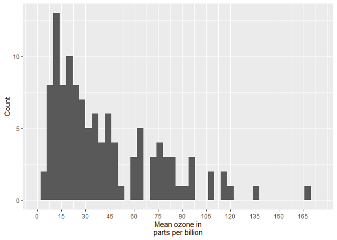<!-- -->

``` r
# add title, subtitle
p7 <- p6+
  labs(title = 'Frequence histogram of mean ozone', 
       subtitle = "Source: New York State Department of Conservation")

p7
```

    ## Warning: Removed 37 rows containing non-finite values (stat_bin).

    ## Warning: Removed 2 rows containing missing values (geom_bar).

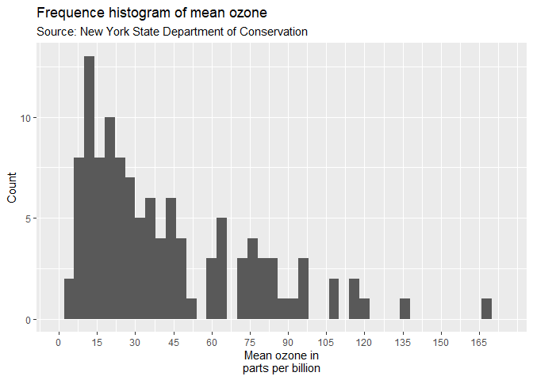<!-- -->

``` r
barfill='tan'
barlines=1

p8 <- airquality %>% 
  ggplot(aes(x=Ozone))+
  geom_histogram(aes(y=..count..), binwidth = 4,color=barlines, fill=barfill)+
  scale_x_continuous(name = "Mean ozone in\nparts per billion", 
                     breaks = seq(0, 175, 15), 
                     limits = c(0, 175))+
  scale_y_continuous(name = "Count")+
  labs(title = "Frequency histogram of mean ozone", 
       subtitle = "Source: New York State Department of Conservation")

p8
```

    ## Warning: Removed 37 rows containing non-finite values (stat_bin).

    ## Warning: Removed 2 rows containing missing values (geom_bar).

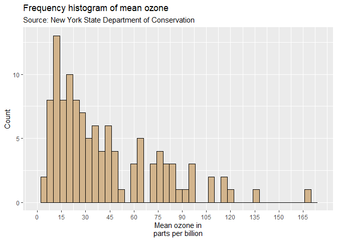<!-- -->

``` r
# color the count gradient

p9 <- airquality %>% 
  ggplot(aes(x=Ozone))+
  geom_histogram(aes(fill=..count..))+
  scale_x_continuous(name = "Mean ozone in\nparts per billion", 
                     breaks = seq(0, 175, 15), 
                     limits = c(0, 175))+
  scale_y_continuous(name = "Count")+
  labs(title = "Frequency histogram of mean ozone", 
       subtitle = "Source: New York State Department of Conservation")+
  scale_fill_gradient("Count", low = 'aliceblue', high = 'deepskyblue')+
  theme_bw()
p9
```

    ## `stat_bin()` using `bins = 30`. Pick better value with `binwidth`.

    ## Warning: Removed 37 rows containing non-finite values (stat_bin).

    ## Warning: Removed 2 rows containing missing values (geom_bar).

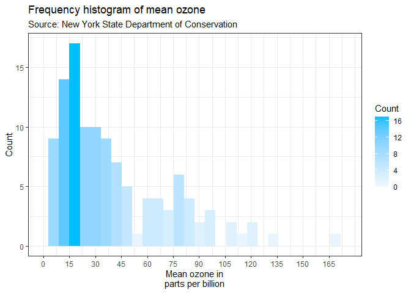<!-- -->

``` r
# economist theme
windowsFonts(
  arial = windowsFont(family = 'Arial'),
  hand = windowsFont(family = 'Lucida Calligraphy'),
  hel = windowsFont(family = 'Helvetica'),
  newman = windowsFont(family = 'Times New Roman'),
  yahei = windowsFont(family = 'Microsoft YaHei')
)

p10 <- p8+
  theme_economist()+
  scale_fill_economist()+
  theme(
    axis.line.x = element_line(size = .5, colour = 1),
    axis.title = element_text(size = 12),
    legend.position = 'bottom',
    legend.direction = 'horizontal',
    legend.box = 'horizontal',
    legend.text = element_text(size = 10),
    text = element_text(family = 'newman')
  )

p10
```

    ## Warning: Removed 37 rows containing non-finite values (stat_bin).

    ## Warning: Removed 2 rows containing missing values (geom_bar).

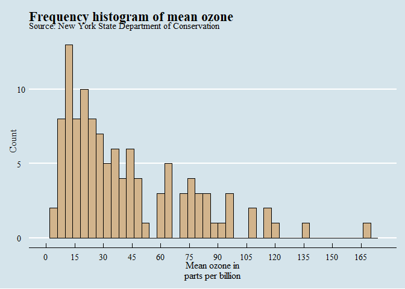<!-- -->

``` r
# add vertical line
p11 <- p10+
  geom_vline(xintercept = 60, size=1, linetype=2, color=222)

p11
```

    ## Warning: Removed 37 rows containing non-finite values (stat_bin).

    ## Warning: Removed 2 rows containing missing values (geom_bar).

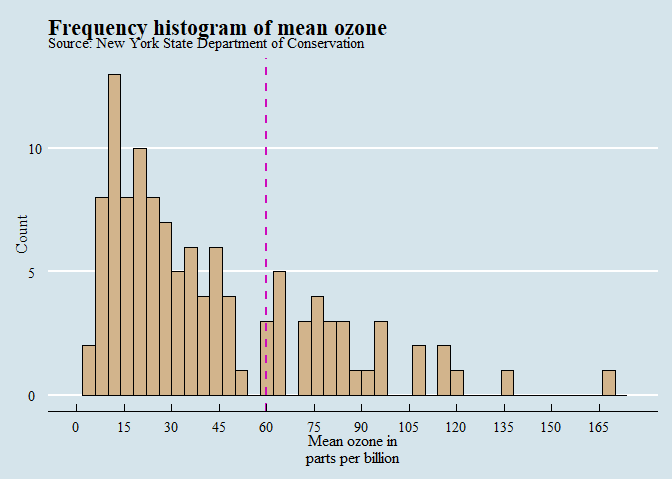<!-- -->

``` r
# facet into 2 months as 2 subplots

airquality_trimmed <- airquality %>% 
  filter(Month %in% c(5, 7)) %>% 
  mutate(Month.f = month.name[Month],
         Month.f = factor(Month.f)) %>% 
  mutate(Month.f = fct_relevel(Month.f, 'May', 'Jul'))
```

    ## Warning: Unknown levels in `f`: Jul

``` r
levels(airquality_trimmed$Month.f)
```

    ## [1] "May"  "July"

``` r
p12 <- airquality_trimmed %>% 
  ggplot(aes(x = Ozone))+
  geom_histogram(aes(y = ..count..), binwidth = 10,
                 color = barlines, fill = barfill)+
  scale_x_continuous(name = "Mean ozone in\nparts per billion", 
                     breaks = seq(0, 175, 25), limits = c(0, 175))+
  scale_y_continuous(name = "Count")+
  labs(title = "Frequency histogram of mean ozone",
       subtitle = "Source: New York State Department of Conservation")+
  facet_grid(.~Month.f, scales = 'free')+
  theme_bw()+
  theme(
    panel.grid = element_blank()
  )


p12
```

    ## Warning: Removed 10 rows containing non-finite values (stat_bin).

    ## Warning: Removed 2 rows containing missing values (geom_bar).

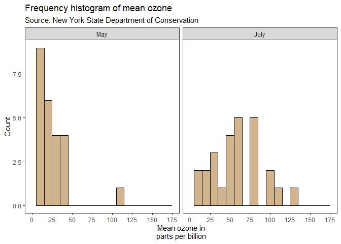<!-- -->

``` r
# compare 2 months in one plot

p13 <- airquality_trimmed %>% 
  ggplot(aes(x = Ozone, fill=Month.f))+
  geom_histogram(aes(y = ..count..), binwidth = 10, position = 'identity', alpha=.5)+
  scale_x_continuous(name = "Mean ozone in\nparts per billion", 
                     breaks = seq(0, 175, 25), limits = c(0, 175))+
  scale_y_continuous(name = "Count")+
  labs(title = "Frequency histogram of mean ozone",
       subtitle = "Source: New York State Department of Conservation",
       # change legend title
       fill = 'Month')+
  scale_fill_brewer(palette = 'Set1')+
  # facet_grid(.~Month.f, scales = 'free')+
  theme_bw()+
  theme(
    panel.grid = element_blank(),
    legend.key = element_blank(),
    legend.position = 'bottom',
    text = element_text(family = 'yahei')
  )


p13
```

    ## Warning: Removed 10 rows containing non-finite values (stat_bin).

    ## Warning: Removed 2 rows containing missing values (geom_bar).

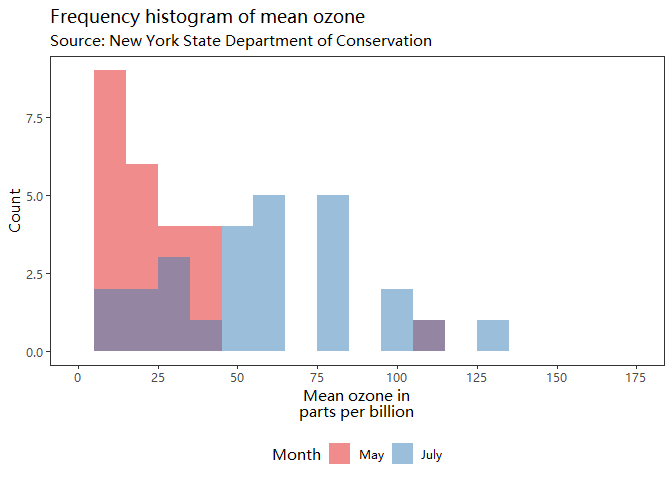<!-- -->
